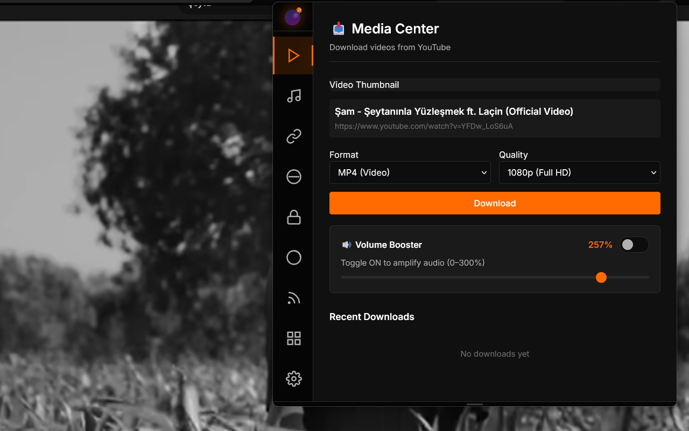
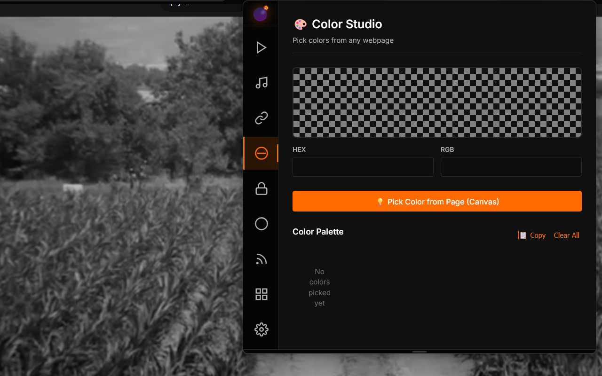
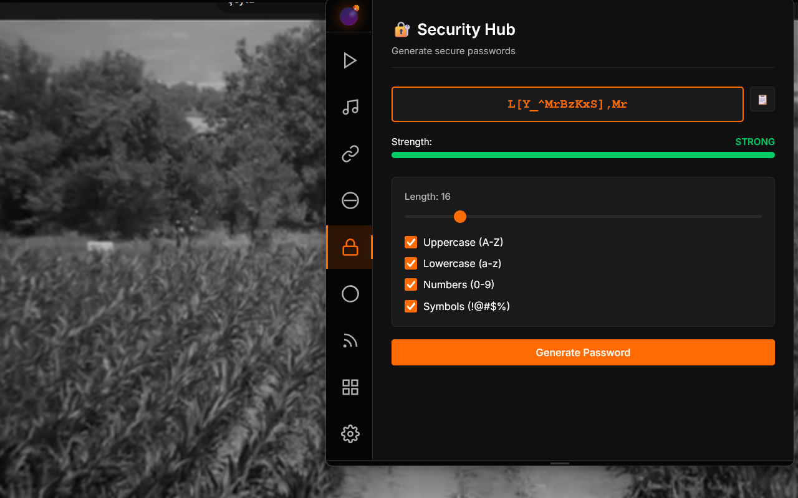

  <a href="#en">🇺🇸 English</a> | <a href="#tr">🇹🇷 Türkçe</a>

# 💣 WebGrenade v4.2.0
### The Unified Power User Utility Suite

---

Welcome to the official repository of **WebGrenade**, a comprehensive browser utility suite designed for web developers, QA testers, and power users. WebGrenade keeps everything local and bundles the most-used browser tools into one dashboard so you do not need separate single-purpose extensions.

## 🛠️ What v4.2.0 Includes

WebGrenade provides a wide array of tools to enhance browsing, development, and testing workflows. The current dashboard includes:

### Main Modules
- **📊 Media Center:** Quick access hub for core browser utilities and media-related tools.
- **🔗 Link Station:** Shorten URLs and generate QR codes for quick sharing.
- **🎨 Color Studio:** Pick colors from any page, copy HEX/RGB values, and manage your palette.
- **🔐 Security Hub:** Generate strong passwords and save the last generated entries locally.
- **🍪 Cookie Manager:** View, edit, add, import, export, and delete cookies for the current domain.
- **📰 RSS Reader:** Subscribe to feeds, refresh items, and manage saved sources.
- **🛠️ Utilities:** Toggle the advanced page tools below from one grouped section.
- **⚙️ Settings:** Configure browser mask, Obsidian paths, and extension preferences.

### Utilities Inside the Dashboard
- **🌙 Dark Mode:** Force a cleaner, high-contrast theme on supported pages.
- **🛡️ Right Click Unlocker:** Remove common right-click and copy restrictions.
- **📺 Picture-in-Picture:** Float supported video players above other windows.
- **📝 Markdown Copier:** Copy the current page title and URL in markdown format.
- **📒 Quick Notes / Scratchpad:** Keep a local note pad with autosave and markdown append support.
- **🚫 Popup Blocker:** Block overlays, popups, and aggressive modal interruptions.
- **🍅 Focus Mode + Site Blocker:** Run a Pomodoro-style timer while blocking selected sites.
- **🗑️ Page Cleaner:** Hide distracting page chrome such as ads and sidebars.
- **💣 History Cleaner:** Remove browsing history entries by domain or URL scope.
- **🪄 Fake Input Filler:** Fill forms with test data for UI and QA workflows.

### Background and Behavior
- **Manifest V3 architecture:** Separate Chrome and Firefox builds with service-worker style background handling where supported.
- **Local-first storage:** Preferences, palettes, notes, feeds, and other state live in `chrome.storage.local`.
- **Cross-module integration:** Quick Notes listens for copied markdown, and Focus Mode keeps site blocking in sync with the timer.
- **Browser-specific fallbacks:** Color picking, timer behavior, and background execution adapt to Chrome and Firefox differences.

---

## 📸 Screenshots

  
   
  <em>The main dashboard providing quick access to all modules.</em>

  
  
   
  <em>Left: Color Studio. Right: Security Hub (Password Generator).</em>

---

## 🦊 Firefox Version

The Firefox version of WebGrenade is optimized for the Gecko engine. Due to Firefox's robust support for various browser APIs, this version may sometimes receive experimental feature updates faster.

**Installation:**
- [Install from Mozilla Add-ons Store](https://addons.mozilla.org/en-US/firefox/addon/webgrenade/) (Official Link)
- *Or install manually via `about:debugging`.*

---

## 🌐 Chrome / Chromium Version (Manifest V3)

The Chrome version is built strictly adhering to the Manifest V3 specification and Google's Single Purpose Policy. It focuses purely on being a "Unified Utility Suite for Power Users."

**Installation:**
- [Install from Chrome Web Store](https://chromewebstore.google.com/detail/web-grenade/epdkpdpihijpabbjhmfnegfjgaelooeb) (Official Link)
- *Note: Due to stricter review processes, updates might take longer to appear in the Chrome Web Store.*

---

## 🔒 Privacy & Security

WebGrenade operates on a "Privacy by Design" model. **All core tools work entirely locally in your browser.**

- **No Remote Tracking:** We do not track your browsing history or collect personal data.
- **External APIs:** Only specific user-initiated actions, such as link shortening or lyric fetching, connect to third-party APIs. This is explicitly disclosed in our [Privacy Policy](PRIVACY.md).
- **Open Source:** Our code is transparent and available for review.

---

## 🤝 Contributing & Support

WebGrenade is open source. Contributions are welcome! If you find a bug or have a feature request, please [open an issue](https://github.com/MacallanTheRoot/webgrenade/issues).

**Developer:** [MacallanTheRoot](https://github.com/MacallanTheRoot)  
**License:** MIT

  

---

# 💣 WebGrenade v4.2.0
### Birleşik İleri Düzey Kullanıcı Araç Seti

---

Web geliştiricileri, QA test uzmanları ve ileri düzey kullanıcılar için tasarlanan kapsamlı tarayıcı araç seti **WebGrenade**'in resmi deposuna hoş geldiniz. WebGrenade tüm araçları yerelde tutar ve tek amaçlı birçok eklenti yerine tek bir pano sunar.

## 🛠️ 4.2.0 Sürümünde Neler Var?

WebGrenade, tarama, geliştirme ve test iş akışlarınızı geliştirmek için geniş bir araç yelpazesi sunar. Mevcut pano şu modülleri içerir:

### Ana Modüller
- **📊 Media Center:** Temel tarayıcı araçları ve medya odaklı işlemler için hızlı erişim merkezi.
- **🔗 Link Station:** URL kısaltma ve hızlı paylaşım için QR kod üretimi.
- **🎨 Renk Stüdyosu:** Herhangi bir sayfadan renk seçin, HEX/RGB değerlerini kopyalayın ve paletinizi yönetin.
- **🔐 Güvenlik Merkezi:** Güçlü şifreler üretin ve son oluşturulan şifreleri yerelde saklayın.
- **🍪 Çerez Yöneticisi:** Geçerli domain için çerezleri görüntüleyin, düzenleyin, içe/dışa aktarın ve silin.
- **📰 RSS Okuyucu:** Feed aboneliklerini yönetin, öğeleri yenileyin ve kayıtlı kaynakları takip edin.
- **🛠️ Utilities:** Aşağıdaki gelişmiş araçları tek bir bölümden açıp kapatın.
- **⚙️ Ayarlar:** Tarayıcı maskesi, Obsidian yolları ve eklenti tercihlerini yapılandırın.

### Pano İçindeki Araçlar
- **🌙 Dark Mode:** Desteklenen sayfalarda daha temiz ve yüksek kontrastlı görünüm sağlayın.
- **🛡️ Sağ Tık Kilidi Açıcı:** Yaygın sağ tık ve kopyalama kısıtlamalarını kaldırın.
- **📺 Picture-in-Picture:** Desteklenen video oynatıcıları diğer pencerelerin üstünde yüzdürün.
- **📝 Markdown Copier:** Geçerli sayfanın başlığını ve URL'sini markdown formatında kopyalayın.
- **📒 Quick Notes / Scratchpad:** Otomatik kayıt ve markdown ekleme destekli yerel not alanı kullanın.
- **🚫 Popup Blocker:** Overlay, popup ve agresif modal kesintilerini engelleyin.
- **🍅 Focus Mode + Site Blocker:** Seçilen siteleri engellerken Pomodoro tarzı zamanlayıcı çalıştırın.
- **🗑️ Page Cleaner:** Reklamlar ve kenar çubukları gibi dikkat dağıtıcı öğeleri gizleyin.
- **💣 History Cleaner:** Geçmiş kayıtlarını domain veya URL kapsamına göre temizleyin.
- **🪄 Fake Input Filler:** UI ve QA akışları için test verileriyle formları doldurun.

### Davranış ve Mimari
- **Manifest V3 mimarisi:** Chrome ve Firefox için ayrı derlemeler ve desteklenen yerlerde service worker tabanlı arka plan işleyişi.
- **Yerel öncelikli kayıt:** Tercihler, paletler, notlar, feed'ler ve diğer durum bilgileri `chrome.storage.local` içinde tutulur.
- **Modüller arası entegrasyon:** Quick Notes, kopyalanan markdown içeriğini dinler; Focus Mode zamanlayıcı ile site engellemesini eş zamanlı tutar.
- **Tarayıcıya özel uyarlamalar:** Renk seçimi, zamanlayıcı davranışı ve arka plan çalışması Chrome ve Firefox farklarına göre uyarlanır.

---

## 📸 Ekran Görüntüleri

  
   
  <em>Tüm modüllere hızlı erişim sağlayan ana pano.</em>

  
  
   
  <em>Solda: Renk Stüdyosu. Sağda: Güvenlik Merkezi (Şifre Üretici).</em>

---

## 🦊 Firefox Sürümü

WebGrenade'in Firefox sürümü Gecko motoru için optimize edilmiştir. Firefox'un çeşitli tarayıcı API'lerine sunduğu esnek destek sayesinde, bu sürüm bazen deneysel özellik güncellemelerini daha hızlı alabilir.

**Kurulum:**
- [Mozilla Eklenti Mağazasından Kur](https://addons.mozilla.org/tr/firefox/addon/webgrenade/) (Resmi Bağlantı)
- *Veya `about:debugging` üzerinden manuel olarak kurun.*

---

## 🌐 Chrome / Chromium Sürümü (Manifest V3)

Chrome sürümü, Manifest V3 spesifikasyonlarına ve Google'ın "Tek Amaç" (Single Purpose) politikasına sıkı sıkıya bağlı kalınarak oluşturulmuştur. Tamamen "İleri Düzey Kullanıcılar İçin Birleşik Araç Seti" olmaya odaklanır.

**Kurulum:**
- [Chrome Web Mağazasından Kur](https://chromewebstore.google.com/detail/web-grenade/epdkpdpihijpabbjhmfnegfjgaelooeb) (Resmi Bağlantı)
- *Not: Daha katı inceleme süreçleri nedeniyle, güncellemelerin Chrome Web Mağazasında yayınlanması daha uzun sürebilir.*

---

## 🔒 Gizlilik ve Güvenlik

WebGrenade, "Tasarım Gereği Gizlilik" (Privacy by Design) modeliyle çalışır. **Tüm temel araçlar tamamen yerel olarak tarayıcınızda çalışır.**

- **Uzaktan İzleme Yok:** Tarama geçmişinizi izlemiyoruz veya kişisel verilerinizi toplamıyoruz.
- **Harici API'ler:** Yalnızca link kısaltma veya şarkı sözü getirme gibi belirli ve kullanıcı tarafından başlatılan eylemler üçüncü taraf API'lere bağlanır. Bu durum [Gizlilik Politikamızda](PRIVACY.md) açıkça belirtilmiştir.
- **Açık Kaynak:** Kodumuz şeffaftır ve herkesin incelemesine açıktır.

---

## 🤝 Katkıda Bulunma ve Destek

WebGrenade açık kaynaklı bir projedir. Katkılarınızı bekliyoruz! Bir hata bulursanız veya yeni bir özellik isteğiniz varsa, lütfen [bir issue açın](https://github.com/MacallanTheRoot/webgrenade/issues).

**Geliştirici:** [MacallanTheRoot](https://github.com/MacallanTheRoot)  
**Lisans:** MIT
